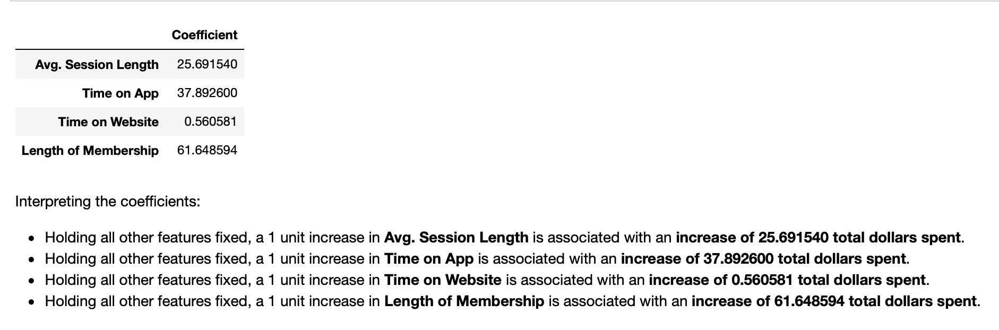

# <h1 align="center"><samp> e-Commerce Recommendation System Project </samp></h1>

### Description:
In this project I will work on the following case study:

*You just got some contract work with an Ecommerce company based in New York City that sells clothing online but they also have in-store style and clothing advice sessions. Customers come in to the store, have sessions/meetings with a personal stylist, then they can go home and order either on a mobile app or website for the clothes they want. The company is trying to decide whether to focus their efforts on their mobile app experience or their website. They've hired you on contract to help them figure it out!*

### Data:
Just for reference, the [data set for this project](Ecommerce Customers dataset) contains Customer info such as Email, Address, and their color Avatar. Then it also has the following numerical value columns:
* Avg. Session Length: Average session of in-store style advice sessions.
* Time on App: Average time spent on App in minutes.
* Time on Website: Average time spent on Website in minutes.
* Length of Membership: How many years the customer has been a member.

### Tools:
* Python
* Numpy
* Pandas
* Matplotlib
* Seaborn
* SciKitLearn
